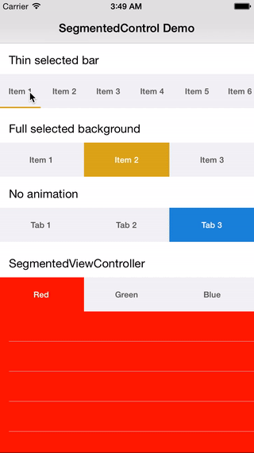

### Updated for Swift 4

Requires Xcode 9 and Swift 4.

### Segmented Controller

- Simple &amp; highly customizable segmented control written in Swift
- Designable on the Interface Builder

### Installation
##### Via Carthage

 - Add `github 'dobaduc/segmentedcontroller'` to your `Cartfile`
 - Run `carthage update`

##### Via Cocoapods

- Add `pod 'SegmentedController'` to your `Podfile`
- Run `pod install`

### Components

- SegmentedControl
 - A customized segmentedControl
- SegmentedViewController
 - A container view controller having a segmented control on top

### Examples
- Check out SegmentedControllerExample project for more details

### License
SegmentedController is released under the MIT license. See [LICENSE](LICENSE) for details.
